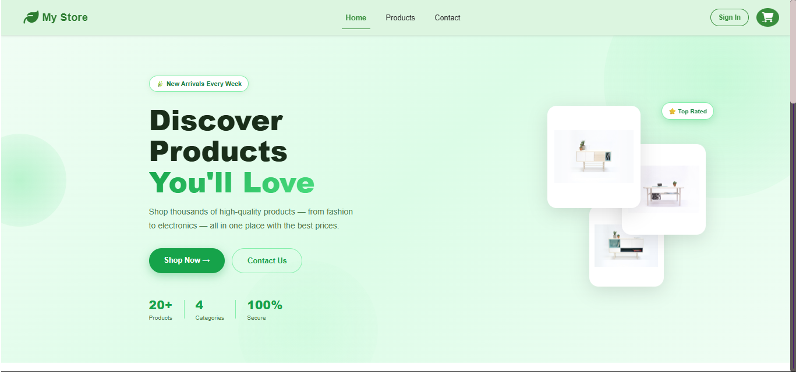

# 🛒 GreenMart Store

A modern, responsive e-commerce web application built with **Vue 3**, **Vite**, and **Pinia**. GreenMart offers a sleek user interface, seamless cart reactivity, and integrated product fetching using the FakeStore API.

## 🌟 Features



- **Modern UI/UX**: Designed with a premium look, vibrant colors, and smooth micro-animations.
- **Dynamic Routing**: Vue Router for seamless navigation between Home, Products, Contact, and Cart.
- **Global State Management**: Powered by Pinia to ensure real-time cart updates (quantities, total price, dynamic cart badge).
- **Product Filtering**: Sort and filter products by category and price using interactive range sliders.
- **REST API Integration**: Fetches real-time product data, categories, and star ratings from [FakeStore API](https://fakestoreapi.com/).
- **Responsive Design**: Fully mobile-friendly layouts that adapt to any screen size.
- **Interactive Forms**: Custom success states and validations for contact and login pages.

## 🛠️ Technology Stack

- **Framework**: Vue.js 3 (Composition API)
- **Build Tool**: Vite
- **State Management**: Pinia
- **Routing**: Vue Router
- **Styling**: Vanilla CSS with Bootstrap (for grid layout)
- **Data Source**: Axios / Fetch API

## 🚀 Getting Started

### Prerequisites
Make sure you have [Node.js](https://nodejs.org/) installed on your machine.

### Installation

1. **Clone the repository:**
   ```bash
   git clone https://github.com/FaroukM2/iti-project.git
   cd iti-project
   ```

2. **Install dependencies:**
   ```bash
   npm install
   ```

3. **Run the development server:**
   ```bash
   npm run dev
   ```

4. **Open the app:**
   Navigate to `http://localhost:3000` (or the port specified by Vite) in your browser.

## 📁 Project Structure

- `src/components/maincomponent/`: Contains all the page views (`home.vue`, `product.vue`, `cart.vue`, `contact.vue`, `login.vue`) and layout pieces (`header.vue`, `footer.vue`).
- `src/piniastore/`: Pinia stores for global state management (`cartstore.js`).
- `src/routers/`: Vue Router configurations.
- `public/images/`: Static image assets.

## 💡 Highlights

- **Reactivity Fixed**: Solved complex reactivity issues in the shopping cart using Vue's `computed` properties combined with Pinia.
- **Premium Design**: Overhauled the original standard design to introduce glassmorphism, dynamic design elements, and custom CSS layouts instead of relying solely on utility classes.

---
*Developed as part of the ITI Full-Stack Web Development track.*
